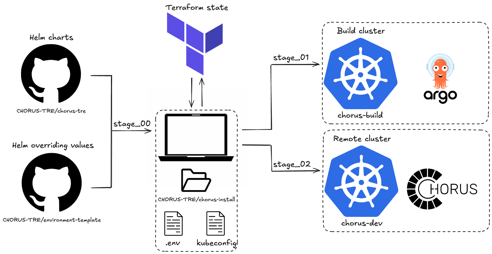

# CHORUS-TRE Installation

## Table of contents
<!-- vim-markdown-toc GFM -->

* [Prerequisites](#prerequisites)
    * [Local machine tools](#local-machine-tools)
    * [Infrastructure](#infrastructure)
    * [Hardware requirements](#hardware-requirements)
        * [Build cluster (ArgoCD)](#build-cluster-argocd)
        * [Remote cluster (Chorus)](#remote-cluster-chorus)
    * [Repositories](#repositories)
* [Install the build cluster](#install-the-build-cluster)
* [Install the remote cluster](#install-the-remote-cluster)
* [Handle existing resources](#handle-existing-resources)
* [Uninstall the remote cluster](#uninstall-the-remote-cluster)
* [Uninstall the build cluster](#uninstall-the-build-cluster)
* [Force uninstall the build cluster](#force-uninstall-the-build-cluster)
* [License and Usage Restrictions](#license-and-usage-restrictions)
* [Acknowledgments](#acknowledgments)

<!-- vim-markdown-toc -->

## Prerequisites

### Local machine tools

| Tool                                                          | Description                                                                                                                                                                                                      |
| ------------------------------------------------------------------ | ---------------------------------------------------- |
| [git](https://git-scm.com/downloads)                               | Git is required to clone this repository             |
| [kubectl](https://kubernetes.io/docs/tasks/tools/install-kubectl)  | Kubernetes command-line tool kubectl is required to run commands against Kubernetes clusters                                                                                                                    |
| [helm 3](https://github.com/helm/helm#install)                     | Helm Charts are used to package Kubernetes resources for each component |
| [terraform](https://developer.hashicorp.com/terraform/install)                     | Terraform is used to automate the installation |
| [yq](https://mikefarah.gitbook.io/yq#install)                     | yq is a lightweight and portable command-line YAML processor |
<!--
| [argocd cli](https://argo-cd.readthedocs.io/en/stable/cli_installation)                     | ArgoCD CLI is required to manage the CHORUS-TRE ArgoCD instance |
| [argo cli](https://argo-workflows.readthedocs.io/en/stable/walk-through/argo-cli/)                            | Argo-Workflows CLI is required to manage CI jobs |
-->

### Infrastructure

| Component          | Description                                                                                                        | Required |
| ------------------ | ------------------------------------------------------------------------------------------------------------------ | -------- |
| Kubernetes cluster | An infrastructure with a working Kubernetes cluster to run ArgoCD (named _build_ cluster in the following) | Required |
| Kubernetes cluster | An infrastructure with a working Kubernetes cluster to run CHORUS and its workspaces (named _remote_ cluster in the following) | Required |
| Domain name        | CHORUS-TRE is only accessible via HTTPS and it's essential to register a domain name via registrars like Cloudflare, Route53, etc. | Required |
| DNS Server         | CHORUS-TRE is only accessible via HTTPS and it's essential to have a DNS server via providers like Cloudflare, Route53, etc. | Required |

### Hardware requirements

The following requirements serve as a lower bound estimate, you might want to increase the size or the number of your nodes depending on your expected workloads.

#### Build cluster (ArgoCD)

| Role               | CPU | Memory (GB)  | Node Storage (GB) | Amount |
|--------------------|-----|--------------|-------------------|--------|
| control-plane,etcd | 8   | 16           | 52                | 3      |
| worker             | 16  | 32           | 208               | 3      |

| PVC amount | PVC total storage (Gi) |
|------------|------------------------|
| 20         | 1500                   |

#### Remote cluster (Chorus)

| Role               | CPU | Memory (GB) | Node Storage (GB) | Amount |
|--------------------|-----|-------------|-------------------|--------|
| control-plane,etcd | 16  | 32          | 52                | 3      |
| worker             | 16  | 32          | 1000              | 3      |

| PVC amount | PVC total storage (Gi) |
|------------|------------------------|
| 50         | 1500                   |

### Networks requirements

| Source        | Destination | Port | Description                                                    |
|---------------|-------------|------|----------------------------------------------------------------|
| Build         | Remote      | 6443 | Needed for ArgoCD to connect to the remote cluster             |
| Remote        | Build       | 443  | Needed for the Remote Harbor to pull images from Harbor Build  |
| External User | Build       | 443  | Access to build cluster services via LoadBalancer              |
| External User | Remote      | 443  | Access to remote cluster services via LoadBalancer             |

### Repositories

| Repository                                                         | Description                                          |
| ------------------------------------------------------------------ | ---------------------------------------------------- |
| [chorus-tre](https://github.com/CHORUS-TRE/chorus-tre) | Repository gathering all the CHORUS Helm charts |
| [environment-template](https://github.com/CHORUS-TRE/environment-template) | Repository gathering all the Helm charts values files |

## Install the build cluster



1. Copy over the environment variables example file and set all the necessary variables for your use case.

    ```sh
    cp .env.example .env
    ```

    > You can find more information about each variable in the `VARIABLES.md` file.
    > Remote cluster related variables are only used in stages 3 and 4.
    > If you only intend to install the build cluster for now, you can leave the remote cluster related variables unset.

1. Source your env file.

    ```sh
    source .env
    ```

1. Make sure one of your [Storage Classes](https://kubernetes.io/docs/concepts/storage/storage-classes/#default-storageclass) is set as default.

   ```sh
   kubectl patch storageclass your-default-storage-class-name -p '{"metadata": {"annotations":{"storageclass.kubernetes.io/is-default-class":"true"}}}'
   ```

1. [Create a workspace on Terraform Cloud](https://developer.hashicorp.com/terraform/cloud-docs/workspaces/create#create-a-workspacehttps) for each stage (e.g. workspace_stage_01, workspace_stage_02).
    Make sure to add the necessary tag to your workspace (e.g. `stage_01` for the workspace used for stage_01).

    > If you don't have access to Terraform Cloud, you can delete all the `backend.tf` files, hence using the default local backend. The local backend type stores state as a local file on disk.

1. Log in to Terraform Cloud

    ```sh
    terraform login
    ```

1. Clone the required repositories.

   **Helm charts repository** - Contains the CHORUS wrapper Helm charts (e.g. https://github.com/CHORUS-TRE/chorus-tre):

    ```sh
    git clone git@github.com:CHORUS-TRE/chorus-tre.git charts
    # or
    git clone https://github.com/CHORUS-TRE/chorus-tre.git charts
    ```

   **Helm values repository** - Contains the overriding Helm values for your clusters (e.g. https://github.com/CHORUS-TRE/environment-template):

    ```sh
    git clone git@github.com:CHORUS-TRE/environment-template.git values
    # or
    git clone https://github.com/CHORUS-TRE/environment-template.git values
    ```

    > Make sure you have git access configured (SSH keys, credentials, etc.) before cloning.
    > Pull the latest changes from these repositories before running terraform if you need to update your configuration.

1. Initialize, plan and apply stage 1.

    > This stage bootstraps the build cluster.

    ```sh
    cd stage_01
    terraform init
    ```
    You'll be prompted to select a workspace.
    Once you selected a workspace, run ```terraform workspace show``` to make sure your selection was correct.
    ```sh
    terraform plan -out="stage_01.plan"
    terraform apply "stage_01.plan"
    ```

    > The ```terraform apply``` command can take several minutes to complete.

1. You'll find important variables (e.g. URLs, admin usernames, admin passwords, load balancer IP) in the "*your-build-cluster-name*_output.yaml" file in the same folder as this readme.

1. Update your DNS record with the load balancer IP address.

    > HTTP-01 challenges will fail as long as our hosts do not resolve properly

1. Make sure the different applications (Harbor, Keycloak, ArgoCD,) can be accessed using your browser. Log into each application using the credentials listed in "*your-build-cluster-name*_output.yaml.

    > The Harbor database authentication page is accessible by appending `/account/sign-in` to the harbor URL (e.g. https://harbor.build.chorus-tre.ch/account/sign-in).

1. Observe ArgoCD gradually taking over the applications management.

    > The applications sync status might be in an unknown state for a few minutes because ArgoCD fails to connect to the Harbor Helm registry (caused by the fact that Harbor initially serves an invalid certificate, and it takes some time for the correct certificate to be provisioned).
    > Also, you might be hitting Let's Encrypt rate limit if you've reinstalled the services too many times lately.

    > As ArgoCD takes over the responsibility for the components that were already deployed (e.g. Keycloak, Harbor), their related services will experience a short unavailability period.

1. Once everything (applications, repositories, clusters) turns green in the ArgoCD UI, the build cluster installation is complete.

    > In case of issues, refer to the official [Kubernetes documentation](https://kubernetes.io/docs/tasks/debug/debug-application/).

## Install the remote cluster

1. Go through steps 1 to 5 of the build cluster installation, making sure environment variables related to the remote cluster were filled in your env file.

1. Initialize, plan and apply stage 2.

   > This stage creates all necessary secrets on the remote cluster and configures the connection from the ArgoCD running on the build cluster. The actual applications deployment will be performed by ArgoCD.

    ```sh
    cd ../stage_02
    terraform workspace list
    terraform init
    ```
    You'll be prompted to select a workspace.
    Once you selected a workspace, run ```terraform workspace show``` to make sure your selection was correct.
    ```sh
    terraform plan -out="stage_02.plan"
    terraform apply "stage_02.plan"
    ```

1. Retrieve the ```token``` and the ```ca.crt``` from the argocd-manager on the remote cluster to fill in the next step

    ```yaml
    caData=$(kubectl get secret argocd-manager-token -ojsonpath='{.data.ca\.crt}')
    bearerToken=$(kubectl get secret argocd-manager-token -ojsonpath='{.data.token}' | base64 -d)
    ```

1. Create the [necessary secret](https://argo-cd.readthedocs.io/en/stable/operator-manual/declarative-setup/#clusters) on the build cluster to start managing the remote cluster using the template below

   ```yaml
   apiVersion: v1
   kind: Secret
   metadata:
     name: "<your remote cluster name>-cluster"
     namespace: argocd
     labels:
       argocd.argoproj.io/secret-type: cluster
   type: Opaque
   stringData:
     name: "<your remote cluster name>"
     server: "<your remote cluster k8s server url>"
     config: |
       {
         "bearerToken": "<authentication token>",
         "tlsClientConfig": {
           "insecure": false,
           "caData": "<base64 encoded certificate>"
         }
       }
   ```

1. Make sure to add the remote cluster to the list of environments in the overriding values of the argo-deploy Helm chart deployed on the build cluster.

   ```yaml
   environments:
     - name: your-cluster-name
       description: your-cluster-description
       envRepoURL: https://github.com/your-organization/environments.git
       registryURL: harbor.build.your-organization.ch
       cluster: your-cluster-name
   ```

1. Make sure a project named after the remote cluster name was created in ArgoCD.

1. Make sure the remote cluster has connection status is "Successful" in ArgoCD.

1. Fetch the loadbalancer IP address using the kubectl command below

   ```sh
   kubectl get svc -n envoy-gateway-system --field-selector spec.type=LoadBalancer -o jsonpath='{.items[0].status.loadBalancer.ingress[0].ip}'
   ```

    > If you get an error, it might simply be due to the service not being ready yet. Check the certificate requests status.

1. Update your DNS record with the load balancer IP address.

1. You'll find important variables (e.g. URLs, admin usernames, admin passwords) in the "*your-remote-cluster-name*_output.yaml" file in the same folder as this readme.

1. Depending on your cluster's security, you might have to explicitly give privilege to some namespaces

  ```yaml
  kubectl label ns prometheus pod-security.kubernetes.io/enforce=privileged
  kubectl label ns velero pod-security.kubernetes.io/enforce=privileged
  ```

1. Once everything (applications, repositories, clusters) turns green in the ArgoCD UI, the remote cluster installation is complete.

    > In case of issues, refer to the official [Kubernetes documentation](https://kubernetes.io/docs/tasks/debug/debug-application/).


1. To deploy a second remote cluster (e.g. to use in the context of a multi-stage deployment), update the ```.env``` file with the new environment's values and follow the remote cluster installation steps once again.

    > Make sure to use dedicated Terraform workspaces to save that new remote cluster state.

## Handle existing resources

In the case where Terraform fails due to existing resources not managed by Terraform,
you can [import](https://developer.hashicorp.com/terraform/cli/import) them.

Error example

```sh
│ Error: namespaces "ingress-nginx" already exists
│
│   with module.ingress_nginx.kubernetes_namespace.ingress_nginx,
│   on ../modules/ingress_nginx/main.tf line 3, in resource "kubernetes_namespace" "ingress_nginx":
│    3: resource "kubernetes_namespace" "ingress_nginx" {
```

Import command

```sh
terraform import module.ingress_nginx.kubernetes_namespace.ingress_nginx ingress-nginx
```

Where
- ```module.ingress_nginx.kubernetes_namespace.ingress_nginx``` is the Terraform object to import the resource into
- ```ingress-nginx``` is the resource ID


## Uninstall the remote cluster

1. Disconnect the remote cluster from the build cluster by deleting the "*your-remote-cluster-name*-cluster" secret from the argocd namespace on the build cluster.

1. Run Terraform destroy command on stage 2

    ```sh
    cd stage_02 && terraform destroy && cd ..
    ```

1. Observe any message indicating some preserved objects (e.g. CRDs, PVCs) and delete those manually.

    > In case you used persistent volumes (PVs) with a "retain" reclaim policy, you'll need to delete each PV as well.

## Uninstall the build cluster

1. Disconnect ArgoCD from GitHub by deleting the "argo-cd-github-environments" secret from the argocd namespace.

1. Delete the ApplicationSet and AppProject resources

    ```sh
    ARGOCD_NAMESPACE="argocd"
    kubectl delete $(kubectl get applicationset -oname -n $ARGOCD_NAMESPACE) -n $ARGOCD_NAMESPACE
    kubectl delete $(kubectl get appproject -oname -n $ARGOCD_NAMESPACE) -n $ARGOCD_NAMESPACE
    ```

1. Run the Terraform destroy command on stage 1

    ```sh
    cd stage_01 && terraform destroy && cd ..
    ```

1. Observe any message indicating some preserved objects (e.g. CRDs, PVCs) and delete those manually.

    > In case you used persistent volumes (PVs) with a "retain" reclaim policy, you'll need to delete each PV as well.

1. Delete hanging resources
    ```sh
    # argo-workflows-server ingress
    kubectl delete $(kubectl get ingress -n kube-system -oname | grep argo-workflows-server) -n kube-system

    # argo-workflows-server service
    kubectl delete $(kubectl get service -n kube-system -oname | grep argo-workflows-server) -n kube-system

    # kube-prometheus service
    kubectl delete $(kubectl get service -n kube-system -oname | grep kube-prometheus) -n kube-system

    # argo-events namespace
    kubectl delete namespace argo-events

    # trivy-system namespace
    kubectl delete namespace trivy-system

    # argocd crds
    kubectl delete $(kubectl get crds -oname | grep argoproj.io)

    # kube-prometheus crds
    kubectl delete $(kubectl get crds -oname | grep monitoring.coreos.com)

    # Optional: clean up all the PersistentVolumes
    kubectl delete $(kubectl get persistentvolume -oname)
    ```

1. Make sure the uninstallation was successful
    ```sh
    kubectl get ns
    # Expected output: system-level namespace only (e.g. kube-***)
    ```

    ```sh
    helm list -A
    # Expected output: system-level charts only (e.g. kube-***)
    ```

### Force uninstall the build cluster

Run ```chmod +x ./scripts/nuke.sh && ./scripts/nuke.sh``` to destroy everything on the build cluster without relying on Terraform.

## License and Usage Restrictions

Any use of the software for purposes other than academic research, including for commercial purposes, shall be requested in advance from [CHUV](mailto:pactt.legal@chuv.ch).

## Acknowledgments

This project has received funding from the Swiss State Secretariat for Education, Research and Innovation (SERI) under contract number 23.00638, as part of the Horizon Europe project “EBRAINS 2.0”.
