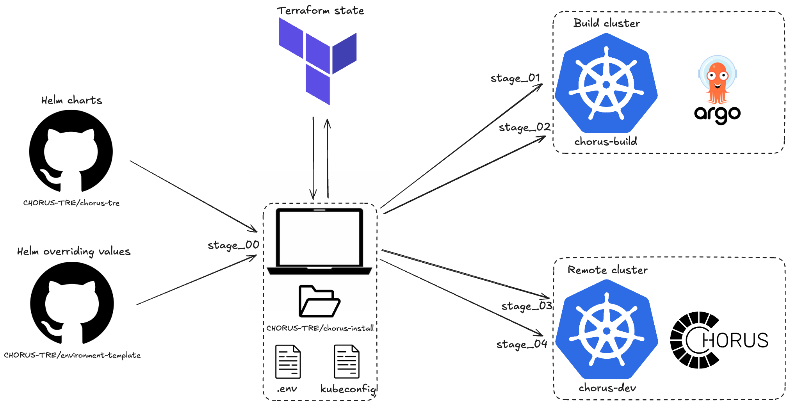

# CHORUS-TRE Installation

## Table of contents
<!-- vim-markdown-toc GFM -->

* [Prerequisites](#prerequisites)
    * [Local machine tools](#local-machine-tools)
    * [Infrastructure](#infrastructure)
    * [Repositories](#repositories)
* [Install](#install)
* [Uninstall](#uninstall)
* [License and Usage Restrictions](#license-and-usage-restrictions)

<!-- vim-markdown-toc -->

## Prerequisites

### Local machine tools

| Tool                                                          | Description                                                                                                                                                                                                      |
| ------------------------------------------------------------------ | ---------------------------------------------------- |
| [git](https://git-scm.com/downloads)                               | Git is required to clone this repository             |
| [kubectl](https://kubernetes.io/docs/tasks/tools/install-kubectl)  | Kubernetes command-line tool kubectl is required to run commands against Kubernetes clusters                                                                                                                    |
| [helm 3](https://github.com/helm/helm#install)                     | Helm Charts are used to package Kubernetes resources for each component |
| [terraform](https://developer.hashicorp.com/terraform/install)                     | Terraform is used to automate the installation |
| [yq](https://mikefarah.gitbook.io/yq#install)                     | yq is a lightweight and portable command-line YAML processor |
<!--
| [argocd cli](https://argo-cd.readthedocs.io/en/stable/cli_installation)                     | ArgoCD CLI is required to manage the CHORUS-TRE ArgoCD instance |
| [argo cli](https://argo-workflows.readthedocs.io/en/stable/walk-through/argo-cli/)                            | Argo-Workflows CLI is required to manage CI jobs |
-->

### Infrastructure

| Component          | Description                                                                                                        | Required |
| ------------------ | ------------------------------------------------------------------------------------------------------------------ | -------- |
| Kubernetes cluster | An infrastructure with a working Kubernetes cluster to run ArgoCD (named _build_ cluster in the following) | Required |
| Kubernetes cluster | An infrastructure with a working Kubernetes cluster to run CHORUS and its workspaces (named _remote_ cluster in the following) | Required |
| Domain name        | CHORUS-TRE is only accessible via HTTPS and it's essential to register a domain name via registrars like Cloudflare, Route53, etc. | Required |  
| DNS Server         | CHORUS-TRE is only accessible via HTTPS and it's essential to have a DNS server via providers like Cloudflare, Route53, etc. | Required |

### Repositories

| Repository                                                         | Description                                          |
| ------------------------------------------------------------------ | ---------------------------------------------------- |
| [environment-template](https://github.com/CHORUS-TRE/environment-template) | Repository gathering all the Helm charts values files |

## Install



1. Copy over the environment variables example file and set all the necessary variables for your use case.

    ```
    cp .env.example .env
    ```
    > You can find more information about each variable in the `VARIABLES.md` file.
    > Remote cluster related variables are only used in stages 3 and 4.
    > If you only intend to install the build cluster for now, you can leave the remote cluster related variables unset.

1. Source your env file.
    ```
    source .env
    ```

1. [Create a workspace on Terraform Cloud](https://developer.hashicorp.com/terraform/cloud-docs/workspaces/create#create-a-workspacehttps) for each stage (e.g. workspace_stage_00, workspace_stage_01, ...).
    Make sure to add the necessary tag to your workspace (e.g. `stage_00` for the workspace used for stage_00).
    > If you don't have access to Terraform Cloud, you can delete all the `backend.tf` files, hence using the default local backend. The local backend type stores state as a local file on disk.

1. Initialize, plan and apply stage 0.
   > This stage downloads the necessary overriding Helm values from the https://github.com/$TF_VAR_github_orga/$TF_VAR_helm_values_repo repository (e.g. https://github.com/CHORUS-TRE/environment-template).

    ```
    cd stage_00
    terraform login
    terraform workspace show
    terraform workspace select workspace_stage_00
    terraform init
    terraform plan -out="stage_00.plan"
    terraform apply "stage_00.plan"
    ```

1. Initialize, plan and apply stage 1.
    > This stage deploys Cert-Manager, Ingress-Nginx, Keycloak and Harbor on the build cluster.

    ```
    cd ../stage_01
    terraform login
    terraform workspace show
    terraform workspace select workspace_stage_01
    terraform init
    terraform plan -out="stage_01.plan"
    terraform apply "stage_01.plan"
    ```
    > **_NOTE:_** 
    > The ```terraform apply``` command can take several minutes to complete.

1. Fetch the loadbalancer IP address using ```terraform output loadbalancer_ip```.

1. Update your DNS with the loadbalancer IP address.

1. Fetch the Harbor URL using ```terraform output harbor_url_admin_login```.
    > At this point, you'll need to login using the database authentication because the OIDC provider authentication configuration is not complete yet.
    > The database authentication page is accessible when appending `/account/sign-in` to the harbor URL (e.g. https://harbor.build.chorus-tre.ch/account/sign-in).

1. Fetch the Harbor password using ```terraform output harbor_username```.
   The default Harbor admin username is "admin".

1. Fetch the Keycloak URL using ```terraform output keycloak_url_login```.

1. Fetch the Keycloak admin password using ```terraform output keycloak_password```.
   The default Keycloak admin username is "admin".

1. Make sure Harbor and Keycloak can be accessed using your browser, then proceed with stage 2.
    > **_NOTE:_** 
    > If you do not wait for certificates to appear as signed and trusted, make sure to disable TLS verification for the Harbor and Keycloak Terraform providers used in stage 2, otherwise you might get the following error ```tls: failed to verify certificate: x509: certificate signed by unknown authority```.

1. Initialize, plan and apply stage 2.
    > This stage configures Harbor (e.g. create registries, projects, robot accounts, upload Helm charts) and Keycloak (e.g. create realms, clients, groups, oidc identity provider), and deploys Argo Workflows, Argo Events and ArgoCD. It also creates all necessary secrets.

    ```
    cd ../stage_02
    terraform login
    terraform workspace show
    terraform workspace select workspace_stage_02
    terraform init
    terraform plan -out="stage_02.plan"
    terraform apply "stage_02.plan"
    ```

    > **_NOTE:_** 
    > The applications' sync status might be in an unkown state for a few minutes because ArgoCD fails to connect to the Harbor Helm registry.
    > This is caused by the fact that Harbor initially serves an invalid certificate, and it takes some time for the correct certificate to be provisioned. 
    > Also, you might be hitting Let's Encrypt rate limit if you've reinstalled the services too many times lately.

    > **_NOTE:_**
    > As ArgoCD takes over the responsibility for the components that were already deployed (e.g. Keycloak, Harbor), their related services will experience a short unavailability period.

1. Make sure the ```build-cluster-name_output.yaml``` file appeared in your local filesystem. 
   At this stage, the build cluster installation is complete.

1. Fetch the ArgoCD URL and credentials from the ```build-cluster-name_output.yaml``` file.
   Make sure the build cluster functions as expected, then proceed to bootstrap a remote cluster.

1. If you did not fill in the remote cluster related variables yet, you need to do so in your `.env` file, source it and re-apply stage 0.

1. Initialize, plan and apply stage 3.
   > This stage installs Cert-Manager CRDs, creates the necessary secrets for Harbor and Keycloak and configures the connection from the ArgoCD running on the build cluster to the remote cluster.

    ```
    cd ../stage_03
    terraform login
    terraform workspace show
    terraform workspace select workspace_stage_03
    terraform init
    terraform plan -out="stage_03.plan"
    terraform apply "stage_03.plan"
    ``` 

1. Initialize, plan and apply stage 4
   > This stage configures Harbor (e.g. create registries, projects, robot accounts, upload Helm charts) and Keycloak (e.g. create realms, clients, groups, oidc identity provider) and creates all necessary secrets.

    ```
    cd ../stage_04
    terraform login
    terraform workspace show
    terraform workspace select workspace_stage_04
    terraform init
    terraform plan -out="stage_04.plan"
    terraform apply "stage_04.plan"
    ```

1. Find all the URLs, usernames and passwords needed in the ```remote-cluster-name_output.yaml``` file

## Handle existing resources

In the case where Terraform fails due to existing resources not managed by Terraform,
you can [import](https://developer.hashicorp.com/terraform/cli/import) them.

Error example

```
│ Error: namespaces "ingress-nginx" already exists
│
│   with module.ingress_nginx.kubernetes_namespace.ingress_nginx,
│   on ../modules/ingress_nginx/main.tf line 3, in resource "kubernetes_namespace" "ingress_nginx":
│    3: resource "kubernetes_namespace" "ingress_nginx" {
```

Import command

```
terraform import module.ingress_nginx.kubernetes_namespace.ingress_nginx ingress-nginx 
```

Where 
- ```module.ingress_nginx.kubernetes_namespace.ingress_nginx``` is the Terraform object to import the resource into
- ```ingress-nginx``` is the resource ID


## Uninstall

1. Destroy the infrastructure

    ```
    cd stage_04
    terraform destroy
    cd ../stage_03
    terraform destroy
    cd ../stage_02
    terraform destroy
    cd ../stage_01
    terraform destroy
    cd ..
    ```

1. Make sure the uninstallation was successful
    ```
    kubectl get ns
    # Expected output: system-level namespace only (e.g. kube-***)
    ```

    ```
    helm list -A
    # Expected output: system-level charts only (e.g. kube-***)
    ```

1. Double check the PVCs and PVs, you might want to clear up those too

> **_NOTE:_** If something goes wrong during the uninstallation, you can run
```./scripts/nuke.sh``` to destroy everything without relying on Terraform

## License and Usage Restrictions

Any use of the software for purposes other than academic research, including for commercial purposes, shall be requested in advance from [CHUV](mailto:pactt.legal@chuv.ch).

## Acknowledgments

This project has received funding from the Swiss State Secretariat for Education, Research and Innovation (SERI) under contract number 23.00638, as part of the Horizon Europe project “EBRAINS 2.0”.
